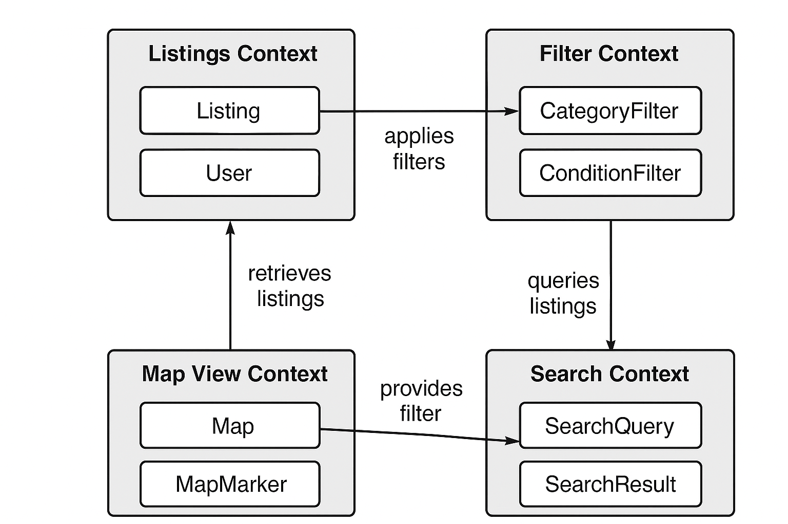

// --
// Author: Karina López Rodríguez
// User: @Kaariinaa08
// Project: Hand-me-down Clothing
// GitHub Issue: #317
// --

= Research Context Mapping for Listings and Filters

== Objective:
Study how context mapping can improve modularity and reduce integration problems with category and condition filters.

== Introduction:
As software systems grow in complexity, managing interactions between different modules becomes increasingly challenging.

Bounded contexts and context mapping are key techniques in strategic design that help identify clear boundaries and integration points in complex systems.

For our platform, listings are filtered by category, condition, and visibility, and can be accessed from multiple views: a list view, a map view, and a search interface.

Without proper context management, inconsistencies and integration conflicts may occur, especially when multiple users interact with the same filters simultaneously.

== Research on Bounded Contexts and Context Mapping:
1. A **bounded context** defines a clear boundary around a specific part of the system where a particular model is valid.
2. **Context mapping** shows how these bounded contexts interact, helping teams coordinate integration and avoid duplication or conflicts.

== Identified Contexts:
Based on the platform’s functionality, we can define the following bounded contexts:

1. Listings Context:
- Core entities: Listing, Item, User
- Operations: Create, Read, Update, Delete listings; manage visibility
- Responsibilities: Ensure listing data integrity

2. Filter Context:
- Core entities: Category Filter, Condition Filter
- Operations: Apply filters, store user preferences
- Responsibilities: Provide consistent filtering logic across views

3. Map View Context:
- Core entities: Map, Map Marker, Geolocation
- Operations: Display listings on map; update marker positions
- Responsibilities: Translate listing data into geospatial representations

4. Search Context:
- Core entities: Search Query, Search Result
- Operations: Execute search with filters; handle paging
- Responsibilities: Ensure fast and accurate search results

_**Note:** The names and entities listed are conceptual examples used to map bounded contexts. They do not necessarily correspond to literal identifiers in the codebase, but represent the underlying functionality and modules of the platform._

== Context Mapping Proposal:

== Examples of Context Mapping in Modular Systems:
- **Frontend**: Separate React modules for Listings, Filters, and Map View, each communicating via defined interfaces or events.
- **Backend**: Microservices or modular services that handle listings data, filter logic, and search indexing independently but synchronize via APIs or message queues.
- **Conflict Prevention**: By clearly defining which context owns the filter logic, we prevent inconsistencies such as mismatched category names or condition values.

== Testing & Validation:
- To ensure context mapping works as intended:
1. Map entities and operations into their respective bounded contexts.
2. Apply filters in one view and verify consistent results in all views.
3. Simulate concurrent access to listings and filters to check for race conditions or inconsistencies.
4. Validate that filter changes propagate correctly without breaking unrelated contexts.
5. Document any integration conflicts and adjust context boundaries as needed.

== Implementation Alignment:
While some of the proposed contexts are already reflected in the current codebase, others represent near-term development goals. This mapping serves as a design foundation for modularizing upcoming features and clarifying ownership boundaries as the project evolves.

== Summary Table of Conflicts Avoided:

[cols="1,2,2", options="header"]
|===
| Context | Potential Conflict | Resolution via Context Mapping

| Listings Context
| Duplicate or inconsistent listing data between views
| Filter and Search contexts access listings through defined interfaces; ownership clearly established

| Filter Context
| Mismatched filter logic across list, map, and search views
| Filter context provides a single source of truth; all views consume the same rules

| Map View Context
| Incorrect marker display due to outdated listings data
| Map view retrieves listings through Listings Context API; no direct manipulation

| Search Context
| Inconsistent search results due to independent filter implementations
| Search context applies filters provided by Filter Context; avoids duplication
|===

== References
1. Evans, Eric. *Domain-Driven Design*. Addison-Wesley, 2003.
2. Vernon, Vaughn. *Implementing Domain-Driven Design*. Addison-Wesley, 2013.
3. Schütz-Schmuck, M. *Strategic Design*, University of Puerto Rico at Mayagüez, 2020.