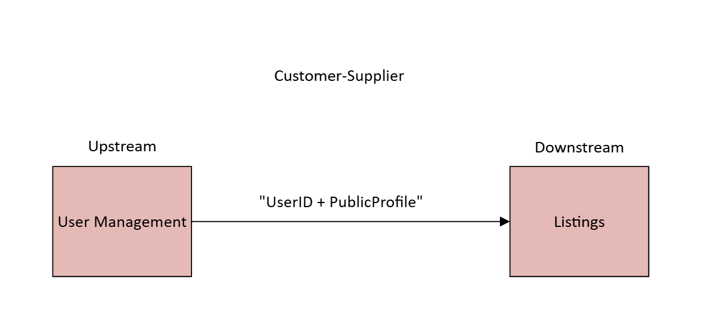

// --
// Author: Yamilette Alemañy Vázquez
// User: @yamilette-alemany
// Project: Hand-me-down Clothing
// GitHub Issue: #321
// --

== Define Context Integration Relationships

Defining context integration relationships is important because it clarifies the data boundaries between different parts of the system. When those boundaries are unclear, domain models begin to leak into each other, making the system harder to maintain and more error-prone. Clear context mappings help ensure that each bounded context owns its own model and only exposes what other contexts truly need.

For this task, I reviewed how the *User Management* and *Listings* contexts interact. Most of the backend integration is still incomplete, so this analysis is based on the intended architecture and the current placeholder UI. The goal is to verify that Listings only accesses the minimum user data required, and to provide guidance for when backend integration is added.

To classify the relationship, I used the standard DDD context-mapping vocabulary: 

    Customer–Supplier (consumer depends on provider contracts)
    Conformist (one adopts the other’s model)
    Shared Kernel (shared domain model)
    Partnership (mutual design)
    Separate Ways (no integration)
    Anti-Corruption Layer (adapter or translation boundary)

In this case, the appropriate relationship between User Management (users as sellers) and Listings is Customer–Supplier, with *User Management* as the *Upstream* and *Listings* as the *Downstream*.

User Management acts as the upstream because it is the source of truth for user identity. A listing must always belong to a valid user, and Listings must adapt to the public contract that User Management exposes. However, Listings should not duplicate or depend on User Management’s internal model. Only the essentials such as user_id and minimal profile fields should cross context boundaries. In the current implementation, Listings correctly stores only a user_id reference. The donor-related data shown on the individual listing page is placeholder UI and should, in a real implementation, be retrieved from User/Profile/Reviews, not stored inside the Listing entity.

This separation maintains context independence.

        - If User Management adds new profile fields (e.g., phone number, biography, address), Listings remains unaffected because it only depends on the stable public identity contract.

        - If Listings changes its own model (price, category, condition, listing state), User Management remains unaffected because it does not rely on any listing-specific structures.

The only shared contract between the two contexts is the UserID and minimal public profile fields needed for display.
Here is a simple diagram that showcases this relationship:

