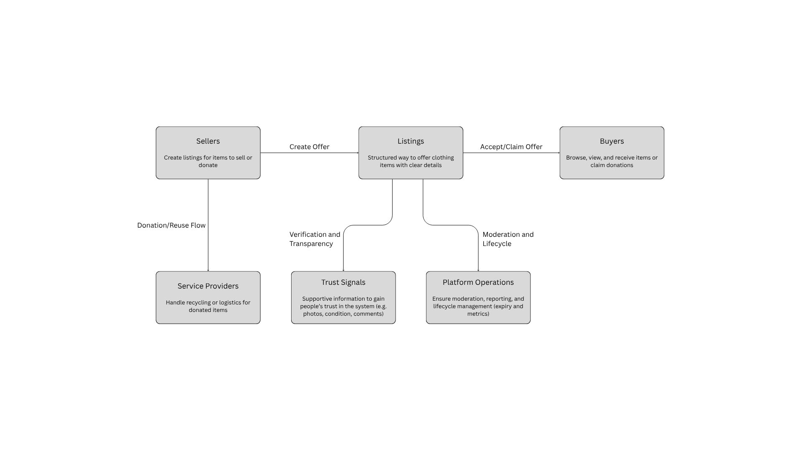

= Explanatory Model

// --
// Author: Fabiola Z. Torres Maldonado
// User: @FabiolaZTorres
// Revdate: 2025-10-24
// Ver: 1.0
// Issue: #197
// --

== Objective
This document contains a diagram aiming to visually communicate the project's domain in an intuitive, non-technical way.  
The goal is to make the system’s purpose and interactions understandable to anyone including team members, stakeholders, or users without requiring implementation knowledge.  
The diagram should clarify how listings, trust, and user interactions form the core of the platform.

== Description
The explanatory model presents a high-level view of how the system operates within its domain.  
It focuses on **conceptual relationships and information flow**, rather than code structure or data design.

In this model:

- **Sellers** create *Listings* to offer clothing items for sale or donation.  
- Each *Listing* represents an *ownership and trust offer*, supported by **Trust Signals** such as photos, condition, and comments.  
- **Buyers** browse, view, and accept these listings to receive items.  
- **Service Providers** manage logistics or recycling for donations that go beyond peer-to-peer transfers.  
- **Platform Operations** handle moderation, reports, and lifecycle tasks like expiry and analytics to maintain system integrity.

This model emphasizes clarity over technical precision, using simple visual flows to convey the key concepts of ownership transfer, trust, and community exchange.  
It serves as a communication tool to help both technical and non-technical audiences understand how the system functions at a conceptual level.

