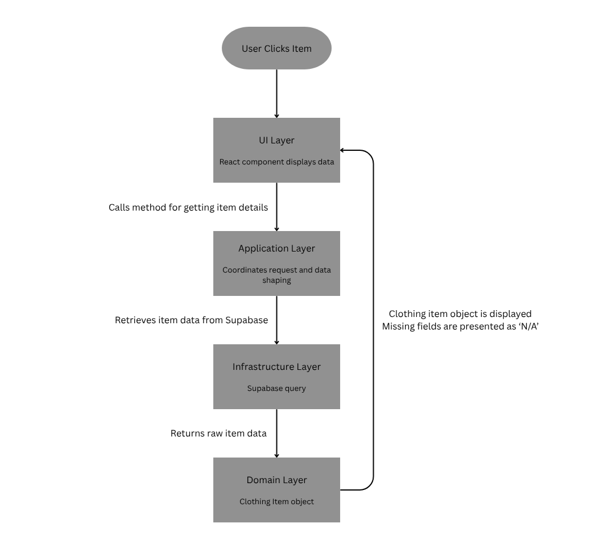

=== Viewing an Individual Clothing Item (Layered Responsibility Demonstration)

==== Objective
Demonstrate how the system retrieves and displays the details of a single clothing item using a layered architecture.  
The goal is to show **clear separation of responsibilities** between the User Interface, Application Logic, Domain Model, and Infrastructure.

==== Description
When a user selects an item from the Browse or Listings page, the system loads a detailed page presenting the item’s information. Although the final implementation is still in progress, the interaction flow and data relationships are already established.

This use case illustrates how one user action moves through different architectural layers without mixing concerns. Each layer contributes a specific part of the process:

* The **UI Layer** presents information and receives interactions.
* The **Application Layer** coordinates the retrieval of item data.
* The **Domain Layer** represents the item as a meaningful concept in the project’s vocabulary.
* The **Infrastructure Layer** communicates with Supabase to fetch stored data.

The data for clothing items is stored in the database table currently known as `pieces`, which holds attributes such as name, description, price, condition, size, category, tags, images, and location.

==== Explanatory Flow

1. User clicks an item from the Browse or Listings page.
2. The UI routing system navigates to the Individual Listing page.
3. The UI calls an application-level function such as `getItemDetails(itemId)`.
4. The function requests item data from Supabase in the **Infrastructure Layer**.
5. Raw data returned from the database is mapped into a **Domain Model** representation (e.g., `ClothingItem`).
6. The UI displays this domain object in a readable, user-friendly form.
7. If any field is missing, default fallback text such as `"N/A"` is presented to maintain clarity.

==== Diagram

