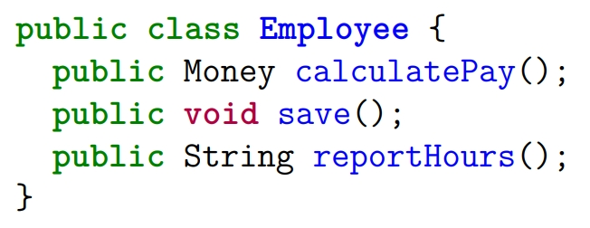
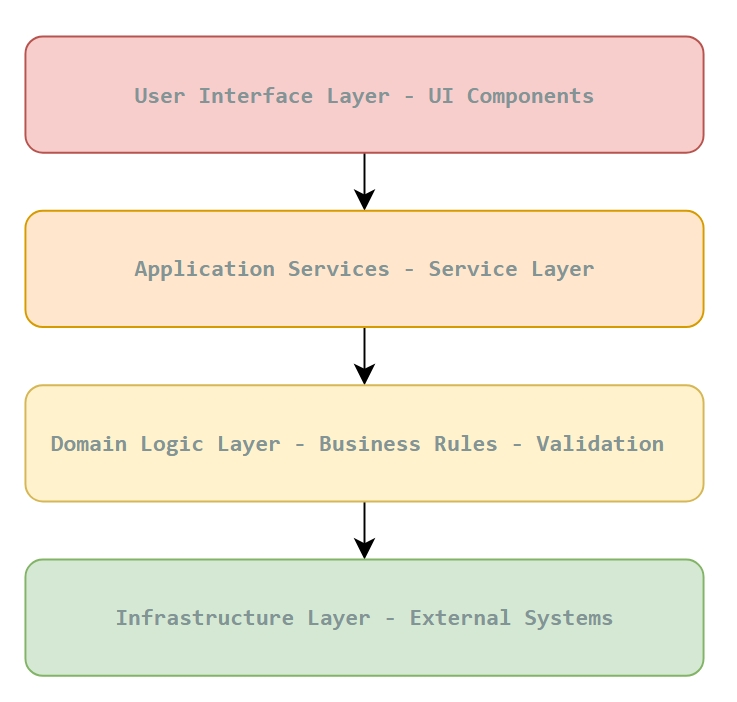

// --
// Author: Karina López Rodríguez
// User: @Kaariinaa08
// Project: Hand-me-down Clothing
// GitHub Issue: #127
// --

= Document Single Responsibility Principle (SRP) for Listing Feature

== Objective:
Investigate and document how the Single Responsibility Principle (SRP), from the Clean Architecture lecture, can be applied to the listing creation and feed functionality, providing guidance for future implementation and code refactoring.

== Description:
The Single Responsibility Principle (SRP) states that a module, class, or function should have **one, and only one, reason to change**. In Clean Architecture, SRP promotes: isolated concerns, reduced coupling, and easier reasoning and testing.

This document focuses on **conceptual application** of SRP for a listing feature.

* **Steps for conceptual SRP application:**
    1. Define distinct responsibilities for each component/module.
    2. Identify potential areas where multiple responsibilities could arise.
    3. Conceptually separate concerns into layers or modules.
    4. Provide examples of modules/components with clear single responsibilities.
    5. Illustrate SRP principles through diagrams or pseudo-code.
    6. Reference Clean Architecture lecture concepts.

== Lecture Concepts Applied:
- **Core SRP idea:** “Gather together the things that change for the same reasons. Separate those things that change for different reasons.”
- **SRP violation example (lecture):**  
  A class combining unrelated responsibilities demonstrates multiple reasons to change, which violates SRP.

=== SRP Violation Lecture Example:

== Conceptual SRP Examples for Listing Feature:
- **Form Component:** Handles only user input and validation.
- **Feed Component:** Renders listings; delegates data fetching to a service layer.
- **Notification Manager:** Manages notifications without knowledge of data sources.
- **Data Service:** Handles all communication with external systems (e.g., Supabase).

== Conceptual Layer Separation:
1. **User Interface Layer:** Visual representation and user interaction only.
2. **Application Services Layer:** Coordinates business rules and communicates with APIs.
3. **Domain Logic Layer:** Encapsulates rules, validation, and decision-making.
4. **Infrastructure Layer:** Handles external systems (data storage, notifications, analytics).

=== Layer Separation Diagram:

== Benefits of Conceptual SRP Application:
- **Clear**, single responsibility per module or component.
- **Easier** reasoning, testing, and debugging.
- **Reduced** risk of unintended side effects during future changes.
- **Modular and maintainable** architecture aligned with Clean Architecture principles.