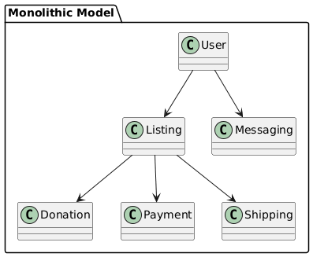
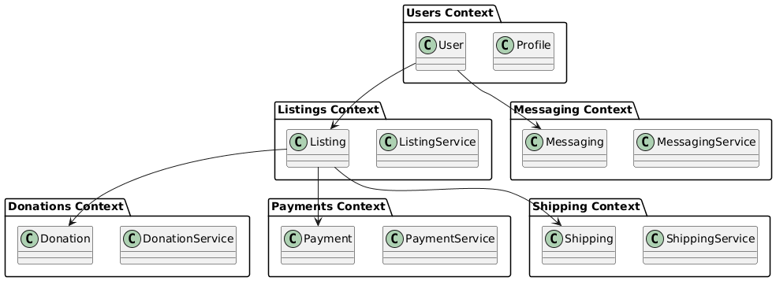

// --
// Author: Karina López Rodríguez
// User: @Kaariinaa08
// Project: Hand-me-down Clothing
// GitHub Issue: #316
// --

:imagesdir: .

= Research Challenges of Monolithic Models in Large-Scale Clothing Platforms

== Objective:
Investigate potential issues caused by monolithic domain models in platforms like our hand-me-down clothing app, including duplication, contradictions, and integration bottlenecks.

== Executive Summary:
Monolithic domain models—where the entire business domain (users, listings, shipping, sizing, grades/conditions, donations, payments, messaging, etc.) is modeled together—can be simpler to start but produce serious long-term costs.  

These include duplicated concepts across teams, contradictory representations (e.g., multiple definitions of “size” or “condition”), integration bottlenecks, and organizational coupling that slows delivery.  

This report catalogs those risks, presents examples relevant to clothing platforms, and recommends decomposition strategies such as bounded contexts, modular monoliths, anti-corruption layers, and event-driven integration.

== Problems and Risks of a Monolithic Domain Model:
=== 1. Duplication of Concepts and Data
* Teams independently adapt the global model (e.g., `size_us` vs `size_eu`).
* Duplicate attributes appear across modules (e.g., `brand`, `material`).
* _Consequences:_ wasted effort, inconsistent updates, diverging analytics.

=== 2. Contradictions and Semantic Drift
* Different meanings for the same field (`condition = new/used/damaged` vs `excellent/good/fair`).
* Boolean flags and exceptions accumulate over time.
* _Consequence:_ broken business logic (filters, returns, eligibility checks).

=== 3. Integration Bottlenecks and Coupling
* Any schema change requires coordination across teams.
* Shared DB migrations affect multiple features at once.
* _Consequence:_ slow delivery and high risk of runtime incidents.

=== 4. Scaling and Performance Hotspots
* Mixed concerns in shared tables cause contention.
* Harder to optimize queries, indexes, and caches.

=== 5. Poor Support for Regional or Domain-Specific Variants
* One-size-fits-all models break for international sizing or localized grading.
* Hard-coded representations resist adaptation.

=== 6. Organizational and Cognitive Load
* New contributors must learn the entire model before making safe changes.
* Team autonomy suffers, reinforcing Conway’s Law.

== Concrete Examples for Clothing Platforms:
. *Size Representation Conflict*: Listings store `size: "M"` while search expects standardized sizes.
. *Condition/Grade Contradictions*: Donation intake uses `"usable"`; resale expects `"excellent/good/fair"`.
. *Duplicate Product Metadata*: `brand` and `material` stored in multiple tables cause reporting mismatches.
. *Shared Database Coupling*: Feed caching logic breaks after another team modifies shared fields.
. *Search & Recommendation Mismatch*: Recommender needs numeric size mapping, but monolith stores vendor-specific text.

== Strategies for Decomposition and Safer Evolution:
=== A. Strategic: Bounded Contexts (DDD)
* Identify subdomains (Listings, Donations, Shipping, Payments, Messaging, Profiles).
* Assign each its own model and language.
* Maintain explicit boundaries and ownership.

=== B. Tactical: Modular Monolith Approach
* Separate modules with internal APIs and data ownership.
* Use schema namespaces or distinct persistence layers.
* Enforce boundaries through code and automated tests.

_*Following Martin Fowler’s “MonolithFirst” principle (2015), starting modular within a single codebase is often more maintainable than premature microservice decomposition.*_

=== C. Integration Patterns
* **Event-driven integration:** Modules publish/subscribe to domain events.
* **Anti-corruption layer (ACL):** Translate between legacy and new models.
* **Shared kernel:** Minimal shared data with strict governance.
* **Consumer-driven contracts:** Validate API expectations continuously.

_*As noted by Gregor Hohpe (2020), clear communication and translation boundaries are essential for scalable system integration.*_

=== D. Data Ownership and Migration
* Each context owns its own persistence model.
* Use versioned schemas and the *Strangler Pattern* for gradual replacement.

=== E. Testing and Automation
* Contract tests between modules.
* Integration tests for event handling and translation logic.
* Chaos testing for message ordering, retries, and duplicates.

== Architecture Sketches:

=== A. Monolithic Model (Shared Schema):

=== B. Modular Monolith (Bounded Contexts):

== References:
* Evans, Eric. *Domain-Driven Design: Tackling Complexity in the Heart of Software*. Addison-Wesley, 2003.  
* Vernon, Vaughn. *Implementing Domain-Driven Design*. Addison-Wesley, 2013.  
* Hohpe, Gregor. *The Software Architect Elevator: Redefining the Architect’s Role in the Digital Enterprise*. Addison-Wesley, 2020.  
* Zalando Tech Blog – “From Monolith to Microservices: Lessons Learned,” 2017.  
* Martin Fowler – “MonolithFirst,” 2015.  