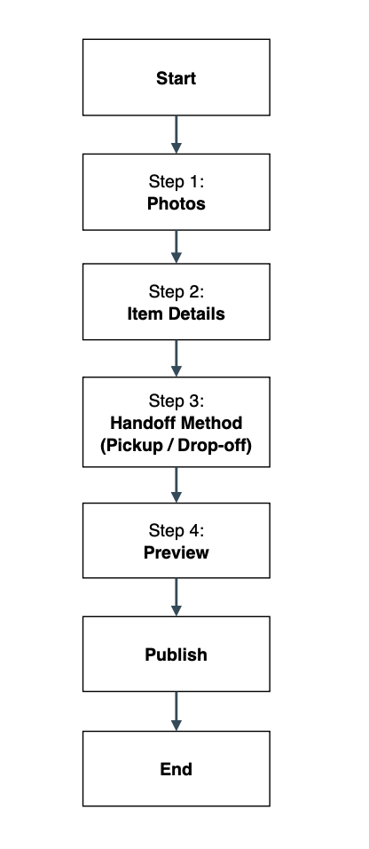

== Objective
Define and document the Donate Listing workflow wireframe to guide future UI design and implementation.

== Scope
Covers web-first UI for creating a *Donate* listing: photo upload, item details, pickup/drop-off method, preview, and publish. Notes required vs optional fields, navigation between steps, and differences from *Sell*.

== Assumptions
* Authenticated user.
* Same underlying `Listing` model as Sell (but price/payment disabled).
* Draft is auto-saved per step.
* Accessibility: all inputs keyboard/screen-reader navigable.

== Primary User Flow
====

====

=== Navigation
* *Next* moves forward if required fields in the step are valid.
* *Back* returns to prior step without data loss.
* Top app bar shows step indicator: `1 • 2 • 3 • 4` (current step emphasized).
* Exit flow warns about unsaved changes if autosave hasn’t completed.

== Wireframes (Lo‑Fi ASCII)
The following frames are illustrative; visual UI will be refined in design.

=== Step 1 – Photos
[.mono]
----
+--------------------------------------+
|  Add Photos (min 1, max 6)           |
|  [ + Add from Camera ] [ + Library ] |
|                                      |
|  [□] [□] [□]  (tap to reorder/remove)|
|                                      |
|  (i) Tip: Show any flaws or wear.    |
+--------------------------------------+
[ Back ]                      [ Next ▶ ]
----

*Required to proceed:* at least 1 photo.

=== Step 2 – Item Details
[.mono]
----
+--------------------------------------+
|  Item Title *                        |
|  [______________________________]    |
|  Category *  [▼]                     |
|  Condition * [New / Good / Fair]     |
|  Quantity *  [ 1 ]                   |
|  Description (optional)              |
|  [______________________________]    |
|  Tags (optional) [  + add tag ]      |
+--------------------------------------+
|  Safety note: no hazardous items.    |
+--------------------------------------+
[ ◀ Back ]                   [ Next ▶ ]
----

=== Step 3 – Handoff Method (Pickup / Drop‑off)
[.mono]
----
+--------------------------------------+
|  Choose one *                        |
|  ( ) Pickup at my location           |
|      • City *  [______________]      |
|      • Neighborhood (optional)       |
|      • Preferred days/times (opt.)   |
|  ( ) Drop-off at a designated point  |
|      • Select location *  [▼]        |
|      • Window availability (optional)|
|  Contact method *                    |
|  [ In‑app messages | Phone | Email ] |
+--------------------------------------+
[ ◀ Back ]                   [ Next ▶ ]
----

=== Step 4 – Preview
[.mono]
----
+--------------------------------------+
|  Preview Listing                     |
|  Photos: [□][□][□] ...               |
|  Title:  "Gently-used blender"       |
|  Category: Kitchen                   |
|  Condition: Good                     |
|  Quantity: 1                         |
|  Handoff: Pickup – City: Mayagüez    |
|  Contact: In‑app messages            |
|  Description: ...                    |
+--------------------------------------+
[ Edit Photos ] [ Edit Details ] [ Edit Handoff ]
[ ◀ Back ]                 [ ✅ Publish ]
----

== Field Specifications
[cols="2,1,3", options="header"]
|===
| Field | Required? | Notes

| Photos (1–6) | *Yes* | First photo becomes cover.
| Title | *Yes* | 5–60 chars; no emojis in first 5 chars.
| Category | *Yes* | Reuse Sell categories; hide price-related.
| Condition | *Yes* | Enum: New / Good / Fair.
| Quantity | *Yes* | Integer ≥1.
| Description | No | 0–500 chars; markdown-lite disabled.
| Tags | No | Up to 5; assists discovery.
| Handoff Method | *Yes* | Radio: Pickup or Drop-off.
| City | *Yes* (if Pickup) | Free text with autosuggest (no precise address).
| Neighborhood | No | Free text.
| Preferred days/times | No | Free text or chips.
| Drop-off location | *Yes* (if Drop-off) | Predefined safe points.
| Contact method | *Yes* | Default: In-app.
|===

== Validation Rules
* Block publish if any required field missing.
* Disallow price/payment fields entirely for Donate.
* Photos: reject HEIC on web; auto-convert or warn.
* Content safety: profanity and hazard terms linting on `Title`/`Description`.

== Differences from *Sell* Workflow
* No `price`, `shipping`, or `payment` steps.
* Handoff focuses on *Pickup/Drop‑off*; no delivery options.
* Emphasis on safety and clarity over monetization hints.
* Listing badge `DONATE` replaces `FOR SALE` UI affordance.

== Step Gate Criteria
[cols="1,3", options="header"]
|===
| Step | Gate to proceed

| 1 – Photos | ≥1 valid image uploaded.
| 2 – Details | Title, Category, Condition, Quantity valid.
| 3 – Handoff | Method selected; context fields valid (City or Drop‑off site); Contact method set.
| 4 – Preview | Publish enabled; otherwise show inline blockers.
|===

== State & Persistence
* Autosave draft after every valid field change.
* Draft schema mirrors Sell Listing minus price/payment.
* On Publish: set `type=donation`, `status=active`, `visibility=public`.

== Accessibility Notes
* Step indicator announced via `aria-current="step"`.
* All actionable icons have labels (“Remove photo”, “Reorder photo”).
* Error messages placed next to fields and summarized at top.

== Open Questions
* Should donors be allowed to specify *max distance* for pickup?
* Moderation rules for prohibited items (e.g., recalls)?
* Limit simultaneous active donation listings per user?

== Testing Plan
* Verify each step is reachable and all required fields are enforced.
* Attempt to *Next* with missing required fields per step – expect inline errors.
* Confirm Back/Next preserve data (autosave).
* Validate Preview matches entered data and that *Publish* only enables when all gates pass.
* Confirm Donate-specific differences (no price/payment UI) are reflected.

== Future Enhancements (Non‑blocking)
* Multi-image reorder via drag & drop.
* Suggested categories from image recognition (privacy-respecting, on-device where possible).
* Quick-duplicate listing for frequent donors.
