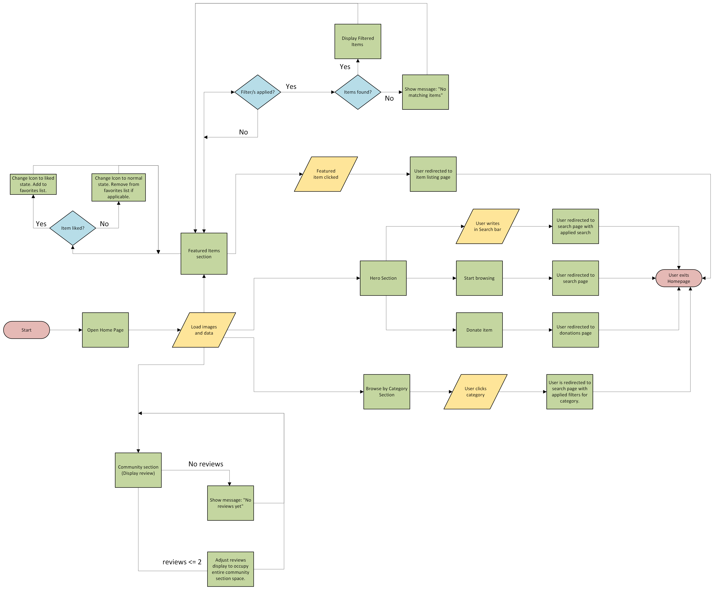

= Homepage Flowchart
:toc:
:toclevels: 2

== Overview
This document contains the flowchart illustrating the main logic of the homepage.
The following diagram represents the homepage logic.  

== Description
* The homepage includes a **Hero Section**, which allows the user to search, donate, or browse listings.  
* The homepage features a **Featured Items Section** that displays highlighted items.  
* If filters are applied, the system checks whether any items match the selected criteria.  
* If matches exist, the filtered items are displayed.  
* If no matches exist, a **“No matching items”** message is shown.  
* If no filters are applied, all featured items remain visible.  
* When a user clicks on a featured item, the system redirects them to the corresponding item listing page.  
* If a user likes an item, the like icon updates to reflect the action.  
* The homepage includes a **Community Section**, where user reviews are displayed.  
* If at least one review exists, it is shown; otherwise, a **“No reviews yet”** message appears.

== Notes
* Exported from Microsoft Visio Web as a 300 PPI PNG for higher clarity.
* The diagram is zoomable — click to open it in a new tab.
