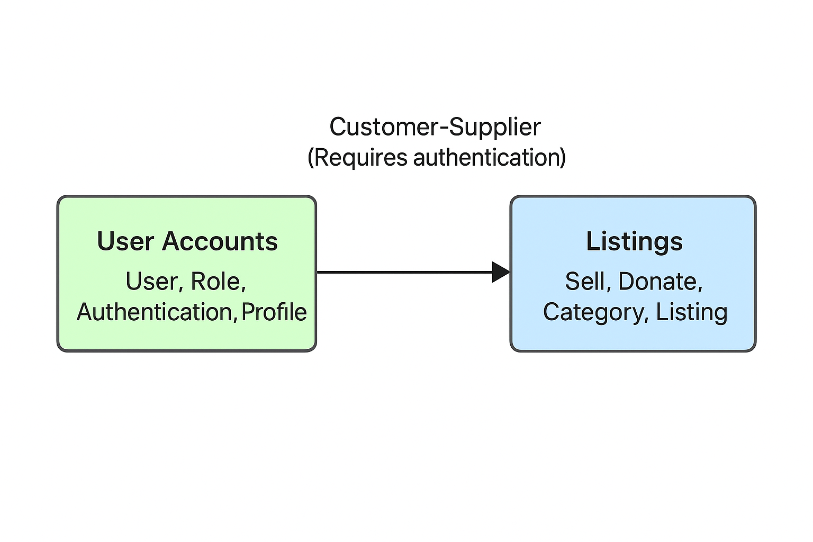

// --
// Author: Alma Piñeiro Calero
// User: @Alma-pineiro
// Project: Hand-me-down Clothing
// GitHub Issue: #330
// --

= Introduction 

Defining Bounded Contexts and creating a Context Map is essential for ensuring clarity, consistency, and maintainability within the system. By explicitly separating different areas of responsibility—such as Listings, and User Accounts—each 
context maintains its own unambiguous definitions and rules, preventing confusion and reducing the risk of errors. This separation of concerns also enables independent development, testing, and scaling of each context, while the Context Map clarifies how contexts \

interact through patterns like Customer-Supplier or Anti-Corruption Layer. Overall, this approach aligns with Domain-Driven Design principles, provides a shared understanding between developers and domain experts, and establishes a solid foundation for future system evolution, including modularization
or migration to microservices.

= Authentication & Listings Bounded Context Map
:toc: false
:icons: font
:source-highlighter: rouge

== Bounded Contexts Diagram
Relationship
Listings --> UserAccounts : Customer-Supplier (Requires authentication)

== Bounded Context Definitions

=== User Accounts
* **Boundary:** Manages user authentication, registration, profiles, and roles.  
* **Responsibilities:** Handle login/logout, user registration, role assignment, and profile management.  
* **Ubiquitous Language:** User, Role, Authentication, Profile

=== Listings
* **Boundary:** Manages product listings in different categories, including Sell and Donate.  
* **Responsibilities:** Ensure listings meet required criteria, manage listing categories, and validate necessary fields.  
* **Ubiquitous Language:** Listing, Category, Sell, Donate

[.text-center]

