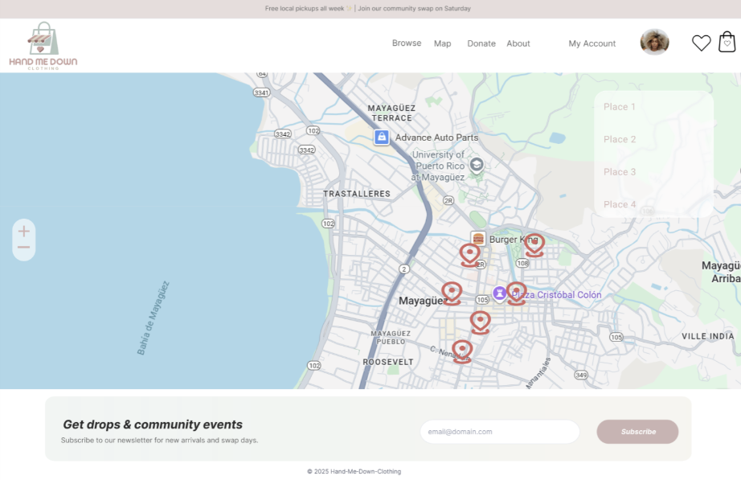

== 2.3.1 Selected Fragments of the Implementation
This section provides selected fragments of the implementation that complement the architecture described in Section 2.3. Instead of full code listings (not yet implemented), this section includes visual representations of the application’s main pages.

=== Home Page

The entry point of the application. Displays recent clothing items and quick navigation options for uploading, browsing items, liked clothing items, the user’s cart, and the map page for local centers.

=== Clothing Listing Page

Shows a landscape UI filled with different clothing items with their respective photo, price, size, condition, and category available for purchase. Each item links to a detail page. The page also includes search and filtering options by category, size, condition, and location. Users can also add items to a "liked list" to save for later viewing.

=== Item Detail Page

Provides detailed information about a specific clothing item selected from the listings page. Includes images, description, size, condition, and location. Users can like, share, or contact the seller. Related items are displayed at the bottom.

=== Map Page

Displays nearby donation and repurposing centers using Leaflet. Locations (stored in Supabase) include name, address, hours, and type of service (donation only or donation-for-credit).

These images complement the architecture by showing how the frontend components (React pages) map to backend logic (JavaScript functions) and data storage (Supabase).
