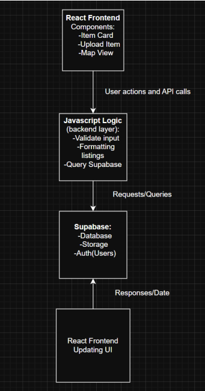

=== 2.3 Implementation

==== Objective
Describe the overall architecture and design of the clothing repurposing application, showing 
how the React frontend, JavaScript logic, and Supabase database/storage/auth components 
work together. Include mockups and example code fragments to complement the explanation. 

==== Description
The application is structured as follows:

* Frontend (React)
** Handles the user interface, including browsing items, uploading clothes, and viewing nearby donation centers.
** Planned pages/screens include:
*** Home Page: shows recent listings and quick navigation to other pages
*** Clothing Listing Page: displays a landscape list of available clothing items
*** Upload Page: allows users to upload clothes for resale or donation
*** Map Page: integrates with Leaflet to display donation centers
** Styling is done with standard CSS (or CSS-in-JS).

* Backend Logic (JavaScript functions)
** Handles business logic directly in JavaScript functions.
** Responsibilities include:
*** Validating form inputs.
*** Managing image uploads to Supabase Storage.
*** Authenticating users via Supabase Auth.
*** Querying data from Supabase Database.

* Database & Storage (Supabase)
** PostgreSQL database stores user profiles, clothing items, and donation center data.
** Supabase Storage stores images.
** Supabase Auth manages authentication and access control.

* External Services
** Leaflet.js for map display.
** Optional geocoding APIs for donation center coordinates.

==== Architecture Diagram
The architecture of the application is designed to clearly separate concerns between the frontend, backend logic, and database/storage/auth services. This structure ensures maintainability, scalability, and clarity for both developers and users.

. Architecture Overview
.. React Frontend
*** Provides the user interface where users can browse clothing items, upload new items and view nearby donation centers on a map powered by Leaflet.
*** User actions such as submitting forms or navigating the map will trigger the API calls to the backend logic.

.. JavaScript Logic (Backend Logic)
*** Acts as the bridge between the frontend layer and Supabase.
*** Responsible for validating inputs, formatting data, and sending queries to Supabase.
*** Handles error responses and passes meaningful data back to the frontend.

.. Supabase Services
*** Database (PostgreSQL) stores data like user profiles, clothing items, and donation center metadata in a structured manner.
*** Cloud Storage manages image uploads securely and makes them easy to retrieve.
*** Auth provides user authentication and access control, ensuring correct data privacy.

.. Data Flow
*** Requests flow downward from the React frontend through the JavaScript backend layer into Supabase, while responses flow upward.
*** Ensures clean separation between UI in React, business logic in JavaScript, and authentication in Supabase.
*** Frontend updates with fresh data dynamically using React's state system.