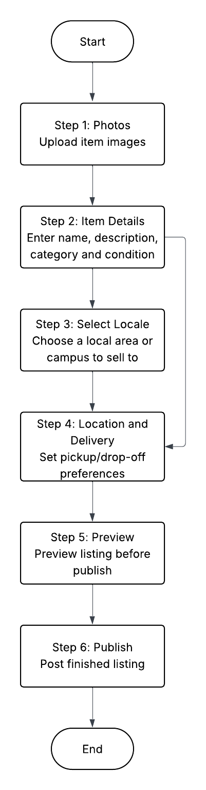

== Objective
Define and document the Sell Listing workflow wireframe to guide future UI design and implementation.

== Scope
Covers web-first UI for creating a *Sell* listing: photo upload, item details, location/delivery, preview, and publish. Notes required vs optional fields, navigation between steps, and differences from *Donate*.

== Assumptions
* Authenticated user.
* Same underlying `Listing` model as Donate (but adds price/payment/shipping).
* Draft is auto-saved per step.
* Accessibility: all inputs keyboard/screen-reader navigable.

== Primary User Flow
====

====

=== Navigation
* *Next* moves forward if required fields in the step are valid.
* *Back* returns to prior step without data loss.
* Top app bar shows step indicator: `1 • 2 • 3 • 4` (current step emphasized).
* Exit flow warns about unsaved changes if autosave hasn’t completed.

== Wireframes (Lo-Fi ASCII)

=== Step 1 – Photos
[.mono]
----
+--------------------------------------+
|  Add Photos (min 1, max 8)           |
|  [ + Add from Camera ] [ + Library ] |
|                                      |
|  [□] [□] [□] (tap to reorder/remove) |
|                                      |
|  (i) Tip: Use clear, well-lit images |
+--------------------------------------+
[ Back ]                      [ Next ▶ ]
----

*Required to proceed:* at least 1 photo.

=== Step 2 – Item Details
[.mono]
----
+--------------------------------------+
|  Item Title *                        |
|  [______________________________]    |
|  Category *  [▼]                     |
|  Condition * [New / Like New / Used] |
|  Quantity *  [ 1 ]                   |
|  Price *      [$_____]               |
|  Delivery Fee (optional) [$_____]    |
|  Description (optional)              |
|  [______________________________]    |
|  Tags (optional) [ + add tag ]       |
+--------------------------------------+
[ ◀ Back ]                   [ Next ▶ ]
----

=== Step 3 – Location & Delivery
[.mono]
----
+--------------------------------------+
|  Location *                          |
|  City [______________]               |
|  Neighborhood (optional)             |
|                                      |
|  Delivery Method *                   |
|  ( ) Local Pickup only               |
|  ( ) Delivery available              |
|      • Fee [$_____]                  |
|      • Delivery radius (km)          |
|                                      |
|  Contact method *                    |
|  [ In-app messages | Phone | Email ] |
+--------------------------------------+
[ ◀ Back ]                   [ Next ▶ ]
----

=== Step 4 – Preview
[.mono]
----
+--------------------------------------+
|  Preview Listing                     |
|  Photos: [□][□][□] ...               |
|  Title:  "Used Textbook – Chem 101"  |
|  Category: Books                     |
|  Condition: Like New                 |
|  Quantity: 1                         |
|  Price: $30                          |
|  Delivery: Pickup – City: Mayagüez   |
|  Contact: In-app messages            |
|  Description: ...                    |
+--------------------------------------+
[ Edit Photos ] [ Edit Details ] [ Edit Delivery ]
[ ◀ Back ]                 [ ✅ Publish ]
----

== Field Specifications
[cols="2,1,3", options="header"]
|===
| Field | Required? | Notes

| Photos (1–8) | *Yes* | First photo becomes cover.
| Title | *Yes* | 5–60 chars.
| Category | *Yes* | Predefined taxonomy.
| Condition | *Yes* | Enum: New / Like New / Used.
| Quantity | *Yes* | Integer ≥1.
| Price | *Yes* | Positive decimal.
| Delivery Fee | No | Used if Delivery selected.
| Description | No | 0–500 chars.
| Tags | No | Up to 5.
| Location | *Yes* | City required, neighborhood optional.
| Delivery Method | *Yes* | Pickup, Delivery, or both.
| Contact method | *Yes* | Default: In-app.
|===

== Validation Rules
* Price must be >0.
* Require at least one valid photo.
* Block publish if any required field missing.
* Disallow duplicate titles from same user within 24h (anti-spam).

== Differences from *Donate* Workflow
* Includes *Price* and *Delivery Fee* fields.
* Delivery options include *local pickup* and *delivery radius* (Donate only had pickup/drop-off).
* Emphasis on commerce and buyer confidence vs safety-only for Donate.
* Listing badge shows `FOR SALE`.

== Step Gate Criteria
[cols="1,3", options="header"]
|===
| Step | Gate to proceed

| 1 – Photos | ≥1 valid image uploaded.
| 2 – Details | Title, Category, Condition, Quantity, Price valid.
| 3 – Location & Delivery | City, Delivery method, Contact method valid.
| 4 – Preview | Publish enabled; otherwise inline blockers.
|===

== State & Persistence
* Autosave draft after every valid field change.
* Draft schema mirrors Donate Listing plus `price`, `deliveryFee`, `deliveryMethod`.
* On Publish: set `type=sell`, `status=active`, `visibility=public`.

== Accessibility Notes
* Step indicator announced via `aria-current="step"`.
* All actionable icons have labels (“Remove photo”, “Reorder photo”).
* Error messages placed next to fields and summarized at top.

== Open Questions
* Should price caps be enforced for student marketplace?
* Payment integrations (placeholder or future expansion)?
* Should sellers specify return/refund policies?

== Testing Plan
* Verify each step is reachable and all required fields are enforced.
* Attempt to *Next* with missing required fields per step – expect inline errors.
* Confirm Back/Next preserve data (autosave).
* Validate Preview matches entered data and that *Publish* only enables when all gates pass.
* Confirm Sell-specific differences (price, delivery) are reflected.

== Future Enhancements (Non-blocking)
* Auto-suggest price ranges from similar items.
* Integration with escrow/payment provider.
* Option to promote listings (highlighted, boosted search).
