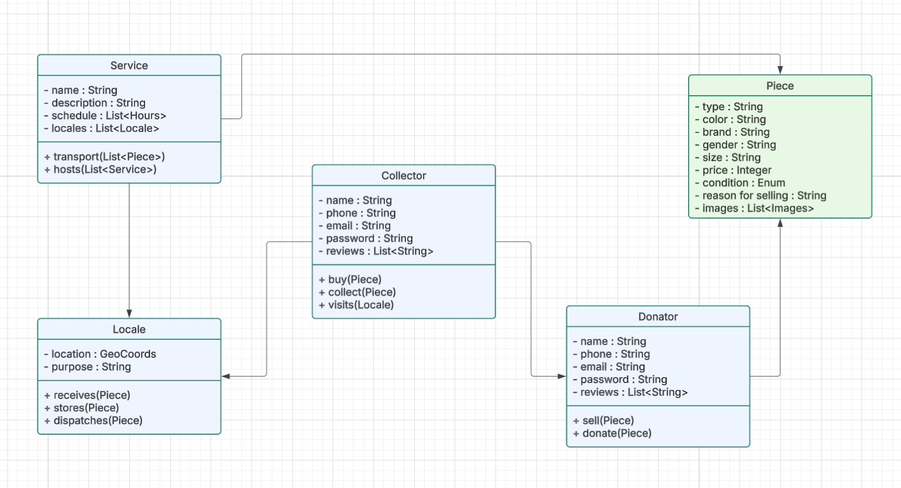

// --
// Author: Kevin Gómez
// Institution: University of Puerto Rico at Mayagüez
// Date Created: 2025-09-08
// Last Updated: 2025-09-11
// Version: 1.2
// Project: Hand-me-down Clothing
// GitHub Issue: #27
// --

# Ubiquitous Language in the Hand-me-down Clothing Project

## Introduction

This document aims to standardize the language model used by all team members when referring to concepts in the Hand-me-down Clothing domain. This ensures consistent understanding and communication between technical and non-technical stakeholders.

The document provides detailed descriptions of the objects, processes, and interactions within the platform. It includes a UML class diagram to visualize how core entities (e.g., Listings, Pieces, Donators, Buyers, Locales) relate and interact. Domain experts and knowledgeable individuals were consulted to thoroughly list and define concepts, with a focus on clear separation and definition of each concept to prevent ambiguity or misinterpretation between developers and stakeholders.

## Methodology

The terms and definitions presented in this document were gathered through consultations with domain experts, review of existing documentation, and collaborative discussions with project stakeholders. This approach ensured comprehensive coverage of relevant concepts and alignment with real-world domain practices.

## Scope

This ubiquitous language applies to the core functionalities of the platform, including donation flow, resale flow, user management, and interactions between users and donation locales. It covers all key entities relevant to donation, resale, and user interactions. Terminology has been aligned with real-world domain practices to support consistent data modeling, database design, and maintainable code, facilitating scalability and future feature additions.

## Stakeholders & Perspectives

- Developers: Ensure technical implementation aligns with the domain model.
- Designers: Maintain consistency in UI and UX terminology.
- Donators and Buyers: Provide clarity for user-facing communication.
- Community organizations: Understand processes related to donations and collection points.

## Glossary of Terms

The glossary serves as the canonical reference for terminology used throughout the project, ensuring unambiguous and comprehensible language for all stakeholders.

- **Donator**: User providing clothing items for resale or donation.
- **Collector**: User purchasing or claiming clothing items.
- **Piece**: Individual clothing item listed for donation or resale.
- **Piece**: Published representation of a listing on the platform, including details.
- **Condition Rating**: Quality measure for a clothing item (e.g., 1-10 scale).
- **Locale**: Physical location or organization for collecting/distributing donations.
- **Review**: Feedback provided by a Buyer or Donator regarding a transaction or experience.
- **Type**: Category or style of clothing (e.g., dress, pants, shirt).
- **Platform**: Hand-me-down Clothing application and its web services.

## Context & Boundaries

This language model focuses on core functionalities such as donations, resale, and user interactions. It explicitly excludes third-party logistics, external payment services, administrative tasks unrelated to donations or resale, and non-clothing items.

## Significance & Future Considerations

The shared language established herein reduces miscommunication between stakeholders and supports accurate data modeling and implementation aligned with real-world concepts. It strengthens collaboration and documentation for both technical and non-technical audiences. Moreover, it facilitates expansion and integration of future features while maintaining consistency across the platform.

## UML Class Diagram

The following diagram illustrates relationships between key entities within the platform, complementing the glossary and supporting the ubiquitous language. It is designed to be understandable by both technical and non-technical team members. To clarify, this is a diagram of what happens in the domain with the purpose of illustrating the interactions between domain elements while employing the ubiquitous language. This is not necessarily a complete representation of the implementation nor its plan.

### Ubiquitous Language Diagram

