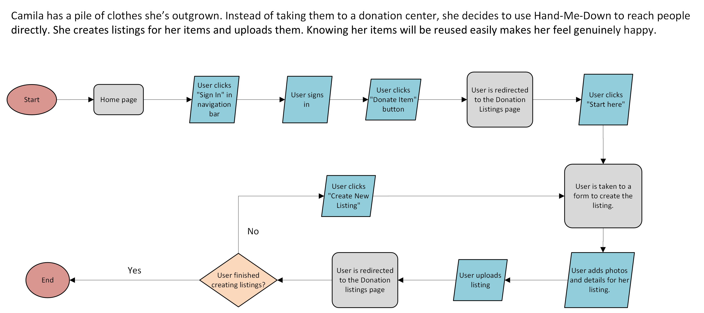

= Hand-Me-Down — Key User Journeys
:toc:
:toclevels: 2

This document describes three core user journeys for Hand-Me-Down: a buyer searching and purchasing, a seller listing and removing an item, and a donor creating donation listings.

== Buyer Journey — “Find & Buy a Dress”
María is looking for a sustainable designer wedding dress. She searches for “Vivienne Westwood dress” on Hand-Me-Down, checks seller legitimacy, adds the dress to her cart, and completes the purchase.

=== Summary of Steps
* User lands on **Home page** and writes on the search bar (e.g., *"Vivienne Westwood Dress"*).
* User is redirected to the **Search page** and **clicks a listing** of interest.
* On the **Listing page**, user **views seller profile** and **verifies legitimacy**.
* User **returns** to the listing and **adds item to cart**.
* If not signed in, user is **prompted to sign in** → **signs in** → item remains **held in cart**.
* User **exits** website.
* User **enters website** and **signs in**.
* User **checks out** and completes the purchase.

=== Flowchart

== Seller Journey — “List & Remove”
Luis wants to declutter and list his old Nike sneakers. He signs up, creates a listing, and later removes it after a family member asks to keep the shoes.

=== Summary of Steps
* From **Home page**, user clicks **Sell** → is redirected to **Sell Listings**.
* User clicks **Start here** and **signs up**.
* User is taken to the **Create Listing form**, **adds photos & details**, and **uploads** the listing.
* Later, user **signs in**, goes to **Profile → View Listings**, selects the **Nike sneakers** listing, and **deletes** it.

=== Flowchart

== Donor Journey — “Create Donation Listings”
Camila decides to donate clothes directly through Hand-Me-Down.

=== Summary of Steps
* From **Home page**, user **signs in** and clicks **Donate Item** → redirected to **Donation Listings**.
* User clicks **Start here** and is taken to the **Create Listing form**.
* User **adds photos & details** and **uploads** the listing → redirected to **Donation Listings**.
* Decision loop: **User finished creating listings?**  
  **No** → repeat **Create New Listing**.  
  **Yes** → **End**.

=== Flowchart

